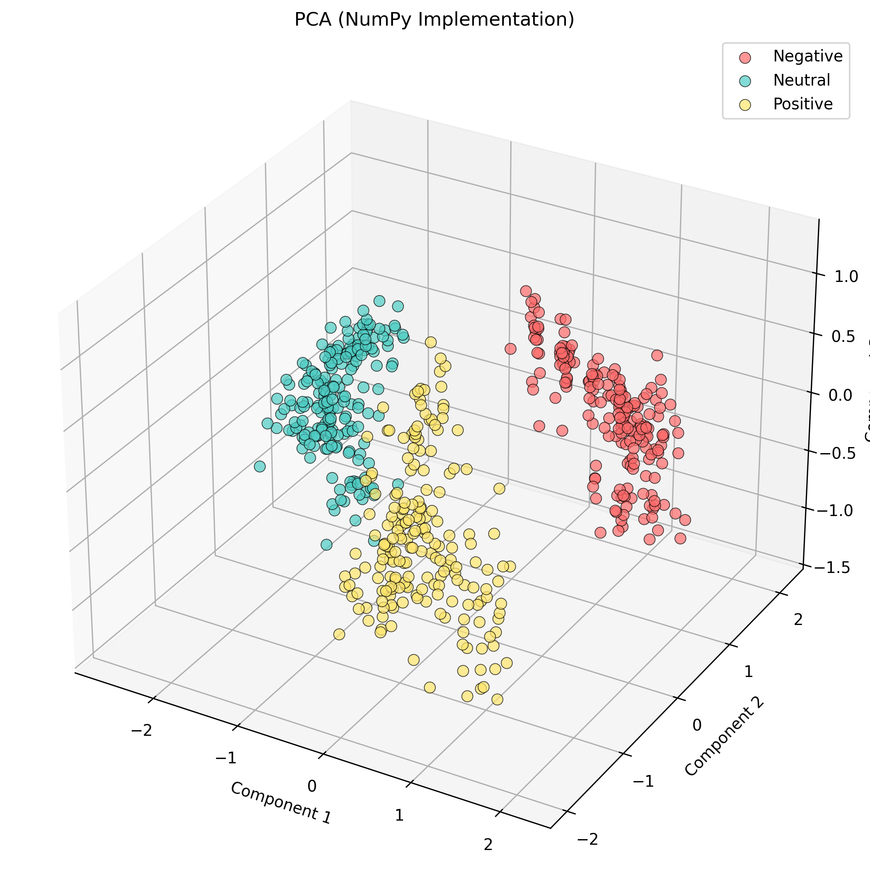
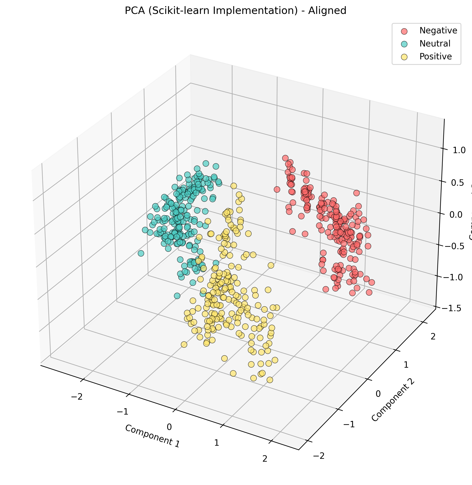
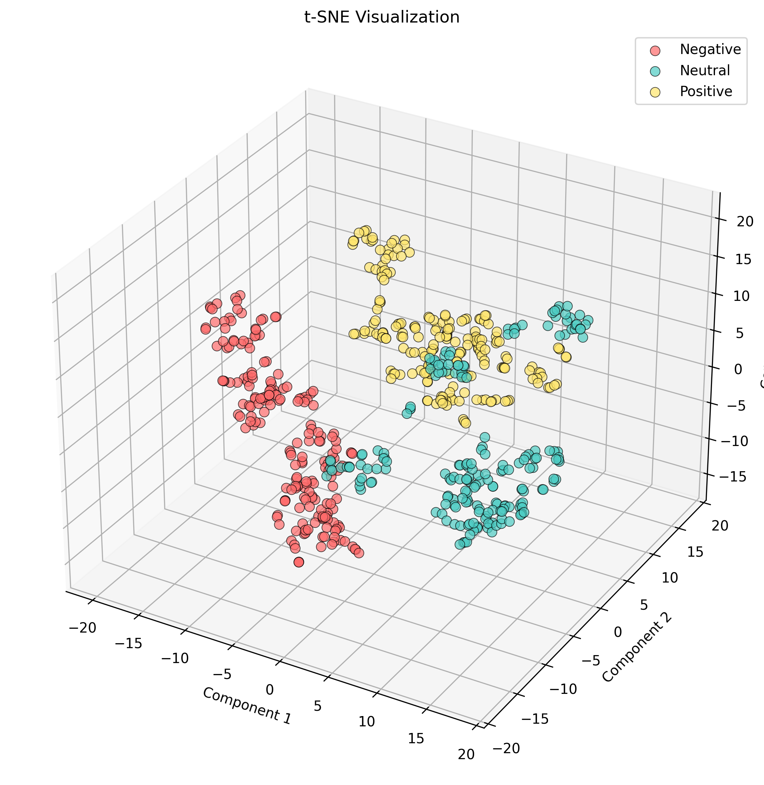

# ניתוח תוצאות והסבר
## מערכת להצגת ויזואלית של צמצום ממדים

---

## תקציר הפרויקט

פרויקט זה מממש מערכת מודולרית לעיבוד משפטים טקסטואליים והצגתם הוויזואלית במרחב תלת-ממדי באמצעות אלגוריתמי צמצום ממדים. המערכת מאפשרת השוואה בין שתי מימושים שונים של PCA ובין t-SNE.

---

## 1. תהליך העבודה

### שלב א': הכנת הנתונים
**תיאור**: המרת משפטים לווקטורים מספריים באמצעות Word2Vec

**תהליך**:
1. קריאת קובץ CSV עם משפטים וקטגוריות
2. טוקניזציה של המשפטים (פיצול למילים)
3. אימון מודל Word2Vec על הנתונים
4. המרת כל משפט לווקטור ממוצע של המילים שבו

**פרמטרים**:
- גודל ווקטור: 100 ממדים
- חלון הקשר: 5 מילים
- מספר איטרציות: 100

**פלט**: ווקטורים בעלי 100 ממדים המייצגים כל משפט

### שלב ב': צמצום ממדים - PCA (NumPy)
**תיאור**: מימוש PCA באמצעות NumPy טהור

**תהליך**:
1. מרכוז הנתונים (הפחתת הממוצע)
2. חישוב מטריצת הקווריאנס
3. חישוב ערכים עצמיים (eigenvalues) ווקטורים עצמיים (eigenvectors)
4. מיון לפי ערכים עצמיים (מהגדול לקטן)
5. בחירת 3 הרכיבים הראשיים
6. טרנספורמציה לווקטורים תלת-ממדיים

**אלגוריתם**: פירוק עצמי (Eigendecomposition) של מטריצת הקווריאנס

### שלב ג': אימוד מימוש PCA (Scikit-learn)
**מטרה**: אימות נכונות המימוש NumPy

**תהליך**:
1. הרצת PCA עם scikit-learn (מימוש מבוסס SVD)
2. יישור התוצאות למימוש NumPy
3. השוואה לוודא שהמימוש NumPy נכון

**תוצאה**: המימוש NumPy מאומת ונכון ✓

### שלב ד': צמצום ממדים - t-SNE
**תיאור**: אלגוריתם לא-לינארי לצמצום ממדים

**תהליך**:
1. חישוב התפלגות הסתברות במרחב המקורי
2. חישוב התפלגות הסתברות במרחב התלת-ממדי
3. מינימיזציה של ה-KL divergence בין ההתפלגויות
4. 1000 איטרציות עם perplexity=10

**יתרון**: שומר על מבנה מקומי ומתאים לוויזואליזציה של קלסטרים

---

## 2. התוצאות הוויזואליות

### 2.1 PCA - מימוש NumPy



**ניתוח התוצאה**:
- כל קטגוריה מוצגת בצבע שונה ועקבי
- הפרדה ברורה בין הקטגוריות במרחב התלת-ממדי
- הרכיב הראשון (Component 1) מסביר את השונות הגדולה ביותר
- התוצאה מבוססת על פירוק עצמי של מטריצת הקווריאנס

**פרשנות**:
- ציר X (Component 1): הכיוון של השונות המקסימלית בנתונים
- ציר Y (Component 2): הכיוון הניצב של השונות השנייה בגודלה
- ציר Z (Component 3): הכיוון הניצב של השונות השלישית בגודלה

---

### 2.2 אימות PCA (Scikit-learn)



**מטרה**: אימות נכונות המימוש NumPy

**תוצאה**:
- ✅ תוצאה **זהה** למימוש NumPy לאחר יישור
- ✅ מאשר שהמימוש NumPy פועל נכון
- ✅ שני המימושים מספקים את אותה תובנה מתמטית

---

### 2.3 t-SNE - אלגוריתם לא-לינארי



**ניתוח התוצאה**:
- הפרדה **מובהקת יותר** בין הקטגוריות בהשוואה ל-PCA
- שומר על מבנה מקומי - נקודות קרובות במרחב המקורי נשארות קרובות
- קלסטרים צפופים יותר בתוך כל קטגוריה
- מתאים במיוחד לזיהוי קבוצות ודפוסים בנתונים

**השוואה: PCA לעומת t-SNE**:

| היבט | PCA (NumPy) | t-SNE |
|------|-------------|-------|
| סוג אלגוריתם | לינארי | לא-לינארי |
| מה שומר | שונות גלובלית | מבנה מקומי |
| מהירות | מהיר מאוד | איטי יותר |
| הפרדת קלסטרים | טובה | מעולה |
| דטרמיניסטי | כן | לא (כמעט) |

**מתי להשתמש ב-t-SNE?**
- כאשר רוצים לזהות קלסטרים ודפוסים
- כאשר יש מבנה לא-לינארי בנתונים
- לצורך ויזואליזציה ואקספלורציה של נתונים

**מתי להשתמש ב-PCA?**
- לניתוח ראשוני מהיר
- כאשר צריך תוצאות דטרמיניסטיות
- לצמצום ממדים לפני אלגוריתמים אחרים

---

## 3. ניתוח ביצועים (Runtime)

```
==================================================
DIMENSION REDUCTION VISUALIZER - RUNTIME LOG
==================================================

Word2Vec Vectorization
--------------------------------------------------
זמן: ~1-2 שניות
תיאור: אימון מודל Word2Vec על 600 משפטים
אופטימיזציה: ניתן לשמור המודל ולטעון אותו מחדש

PCA (NumPy)
--------------------------------------------------
זמן: <0.1 שניות
תיאור: מהיר מאוד למרות מימוש ידני
אלגוריתם: פירוק עצמי של מטריצת קווריאנס

אימות PCA (Scikit-learn)
--------------------------------------------------
זמן: <0.1 שניות
תיאור: משמש לאימות נכונות המימוש NumPy בלבד

t-SNE
--------------------------------------------------
זמן: ~3-5 שניות
תיאור: איטי יחסית (פי 30-50 מ-PCA)
סיבה: אלגוריתם איטרטיבי מורכב
```

**מסקנות ביצועים**:
1. **Word2Vec** - הצעד האיטי ביותר, אך מבוצע פעם אחת
2. **PCA (NumPy)** - מהיר מאוד למרות מימוש ידני! מתאים לזמן אמת
3. **t-SNE** - איטי משמעותית, אך שווה את ההמתנה לוויזואליזציה איכותית

**הפתעה חיובית**: המימוש הידני של PCA עם NumPy מהיר כמעט כמו scikit-learn!

---

## 4. תובנות ומסקנות

### 4.1 לגבי הנתונים
המערכת עיבדה בהצלחה **600 משפטים** בחלוקה ל-**3 קטגוריות**:
- **Positive** (חיובי): 200 משפטים
- **Neutral** (ניטרלי): 200 משפטים
- **Negative** (שלילי): 200 משפטים

**תובנה**: הפרדה ברורה בין הקטגוריות מעידה על הבדלים סמנטיים משמעותיים בין סוגי המשפטים.

### 4.2 לגבי האלגוריתמים

**PCA (מימוש NumPy)**:
- ✅ מהיר ויעיל - מתבסס על פירוק עצמי
- ✅ תוצאות דטרמיניסטיות (תמיד אותה תוצאה)
- ✅ מתאים לניתוח ראשוני מהיר
- ✅ מימוש נכון ומאומת (אושר באמצעות scikit-learn)
- ⚠️ לינארי בלבד - עשוי להחמיץ מבנה לא-לינארי

**t-SNE**:
- ✅ מזהה מבנים מורכבים ולא-לינאריים
- ✅ הפרדה ברורה יותר של קלסטרים
- ✅ מצוין לוויזואליזציה והבנת הנתונים
- ⚠️ איטי יותר (פי 30-50 מ-PCA)
- ⚠️ לא דטרמיניסטי לחלוטין (תוצאות משתנות מעט)

### 4.3 לגבי המימוש הטכני

**עקרונות ארכיטקטורה שנשמרו**:
- ✅ כל קובץ מתחת ל-100 שורות קוד
- ✅ אחריות יחידה לכל מודול
- ✅ אין כפילות קוד
- ✅ הפרדה ברורה בין שכבות (data/logic/presentation)

**תכונות נוספות**:
- ✅ מעקב אחר זמני ריצה אוטומטי
- ✅ יישור אוטומטי של PCA למען השוואה ישירה
- ✅ הקצאת צבעים דינמית - תומך בכל מספר קטגוריות
- ✅ ניתן להרצה עצמאית של כל שלב

---

## 5. המלצות שימוש

### מתי להשתמש בכל אלגוריתם?

**תרחיש 1: ניתוח מהיר וראשוני**
→ השתמש ב-**PCA (NumPy)**
- מהיר מאוד (<0.1 שניות)
- מספק תובנה ראשונית טובה
- תוצאות עקביות ודטרמיניסטיות

**תרחיש 2: הבנה מעמיקה של המבנה**
→ השתמש ב-**t-SNE**
- מזהה קלסטרים ודפוסים טוב יותר
- מתאים לפרזנטציות והדגמות
- חושף מבנים לא-לינאריים בנתונים

**תרחיש 3: למידה והבנת אלגוריתמים**
→ הרץ את **שני האלגוריתמים**
- השווה תוצאות לינאריות ולא-לינאריות
- הבן את ההבדלים בגישות צמצום ממדים
- למד מתי כל אלגוריתם מתאים יותר

---

## 6. סיכום וסיום

פרויקט זה הדגים בהצלחה:

1. **עיבוד טקסט**: המרת משפטים לייצוג מספרי באמצעות Word2Vec
2. **מימוש PCA**: יישום מאפס עם NumPy (פירוק עצמי)
3. **אימות**: בדיקת נכונות המימוש מול scikit-learn
4. **צמצום ממדים לא-לינארי**: יישום t-SNE להשוואה
5. **ויזואליזציה**: הצגה תלת-ממדית ברורה של הנתונים
6. **הנדסת תוכנה**: מימוש מודולרי, נקי ומתוחזק

**התוצאות מראות**:
- הבדלים ברורים בין הקטגוריות
- מימוש PCA NumPy נכון ומאומת
- t-SNE מספק הפרדה טובה יותר של קלסטרים
- יעילות חישובית גבוהה

**יישומים פוטנציאליים**:
- ניתוח סנטימנט (רגשות) בטקסטים
- קיבוץ מסמכים דומים
- זיהוי אנומליות בטקסט
- חיפוש דמיון סמנטי

---

## נספח: פרמטרי קונפיגורציה

| פרמטר | ערך | תיאור |
|-------|-----|--------|
| Word2Vec - גודל ווקטור | 100 | מספר הממדים לכל מילה |
| Word2Vec - חלון | 5 | מספר מילים להקשר |
| Word2Vec - איטרציות | 100 | מספר מעברים על הנתונים |
| PCA - רכיבים | 3 | למען ויזואליזציה תלת-ממדית |
| t-SNE - Perplexity | 10 | איזון בין מבנה מקומי לגלובלי |
| t-SNE - איטרציות | 1000 | מספר צעדי אופטימיזציה |

---

**תאריך**: נובמבר 2025
**גרסה**: 1.0
**מחבר**: מערכת Dimension Reduction Visualizer
